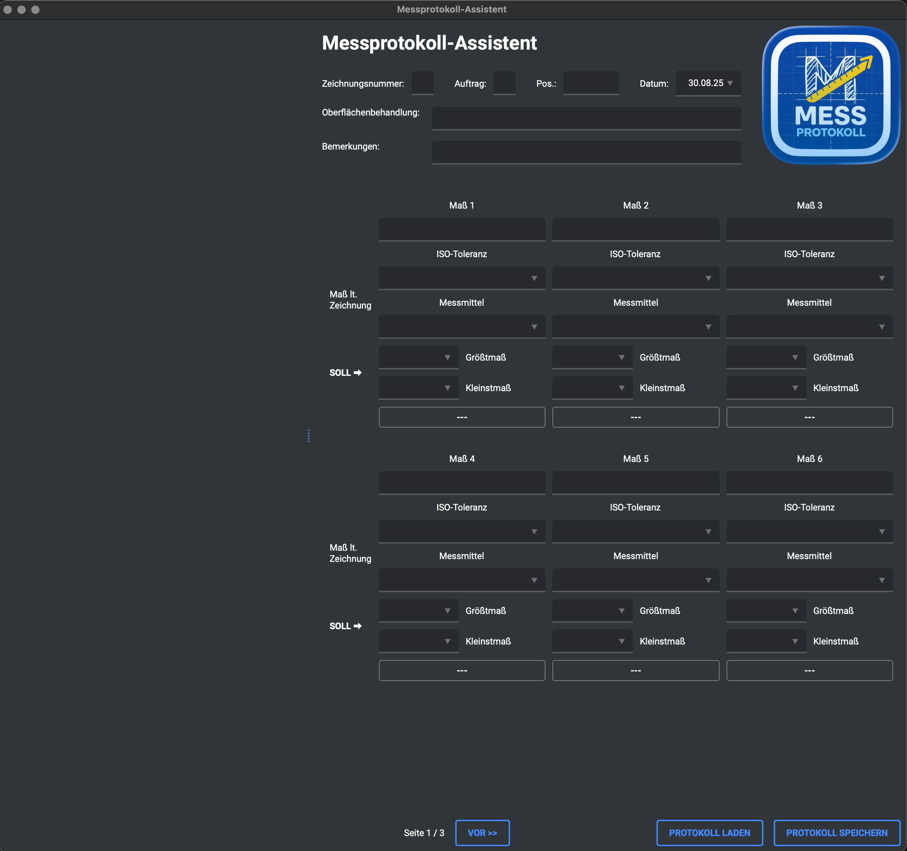

# Messprotokoll-Assistent

Ein Desktop-Assistent zur teilautomatisierten Erstellung von Messprotokollen durch die interaktive Verknüpfung von DXF-Zeichnungen mit einem digitalen Formular.



## Über das Projekt

Der Messprotokoll-Assistent ist eine mit Python und PySide6 entwickelte Desktop-Anwendung, die den Prozess der Qualitätskontrolle vereinfachen soll. Anstatt Maße manuell von einer technischen Zeichnung in ein Protokoll zu übertragen, ermöglicht diese Anwendung das Laden einer DXF-Datei, die visuelle Auswahl von Bemaßungen und die direkte Übertragung der Werte in ein Messprotokoll-Formular.

Das ausgefüllte Protokoll kann anschließend als formatierte Excel-Datei (`.xlsx`) exportiert werden, basierend auf einer anpassbaren Vorlage.

## Hauptfunktionen

-   **Integrierter DXF-Viewer**: Laden und Anzeigen von 2D-DXF-Dateien mit Zoom- und Pan-Funktionen.
-   **Interaktive Datenübernahme**: Klicken Sie auf eine Bemaßung oder einen Text in der DXF-Zeichnung, um den Wert automatisch in das ausgewählte Formularfeld zu übertragen.
-   **Dynamische Toleranzberechnung**: Automatische Berechnung der oberen und unteren Abmaße basierend auf Nennmaß und ausgewählter ISO-Passung (z.B. H7).
-   **Strukturierte Dateneingabe**: Übersichtliches Formular zur Erfassung von Kopfdaten (Zeichnungsnummer, Auftrag etc.) und bis zu 18 einzelnen Messpunkten.
-   **Export nach Excel**: Speichert das fertige Protokoll in einer `.xlsx`-Datei, die auf der `LEERFORMULAR.xlsx`-Vorlage basiert. Die Zellen-Zuweisung wird über die `mapping.json`-Datei gesteuert.
-   **Cross-Plattform**: Dank GitHub Actions werden Builds für Windows und macOS (Apple Silicon) automatisch erstellt.

## Downloads / Releases

Fertig kompilierte Versionen der Anwendung für Windows und macOS finden Sie auf der [**Releases-Seite**](https://github.com/hannesfox/MessKIpro/releases).

Laden Sie einfach das ZIP-Archiv für Ihr Betriebssystem herunter, entpacken Sie es und starten Sie die Anwendung.

## Lokale Entwicklungsumgebung

Um die Anwendung aus dem Quellcode auszuführen oder weiterzuentwickeln, folgen Sie diesen Schritten:

1.  **Repository klonen:**
    ```bash
    git clone  https://github.com/hannesfox/MessKIpro.git
    cd MessKIpro
    ```

2.  **Virtuelle Umgebung erstellen und aktivieren:**
    ```bash
    # Für macOS / Linux
    python3 -m venv venv
    source venv/bin/activate

    # Für Windows
    python -m venv venv
    .\venv\Scripts\activate
    ```

3.  **Abhängigkeiten installieren:**
    Die `requirements.txt` enthält die Kern-Abhängigkeiten. Für die Entwicklung und den Build-Prozess werden weitere Pakete benötigt.
    ```bash
    pip install -r requirements.txt
    pip install qt-material Pillow pyinstaller
    ```

4.  **Anwendung starten:**
    ```bash
    python main.py
    ```

## Verwendete Technologien

-   **GUI-Framework**: [PySide6](https://www.qt.io/qt-for-python)
-   **DXF-Dateiverarbeitung**: [ezdxf](https://ezdxf.mozman.at/)
-   **Excel-Export**: [openpyxl](https://openpyxl.readthedocs.io/en/stable/)
-   **GUI-Theming**: [qt-material](https://github.com/UN-GCPDS/qt-material)
-   **Packaging**: [PyInstaller](https://pyinstaller.org/en/stable/)

## Projektstruktur

```
.
├── .github/workflows/build.yml   # GitHub Actions Workflow für CI/CD
├── Data/
│   └── tolerances.json           # Daten für ISO-Passungsberechnung
├── assets/
│   └── logo.png                  # Anwendungslogo
├── LEERFORMULAR.xlsx             # Excel-Vorlage für den Export
├── main.py                       # Hauptanwendungscode (GUI und Logik)
├── mapping.json                  # Definiert die Zuordnung von UI-Feldern zu Excel-Zellen
├── README.md                     # Diese Datei
└── requirements.txt              # Python-Abhängigkeiten
```

## Lizenz

Dieses Projekt ist unter der MIT-Lizenz lizenziert. Weitere Informationen finden Sie in der `LICENSE`-Datei.
*(Empfehlung: Fügen Sie eine Datei namens `LICENSE` mit dem MIT-Lizenztext in Ihr Repository ein.)*